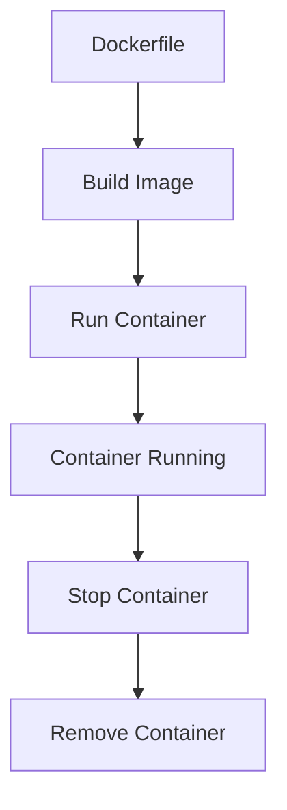

# Subject 4: Dockerizing Projects & Docker Fundamentals

## Overview

This subject introduces containerization with Docker, teaching students how to package applications and their dependencies into portable containers. You'll learn to create Dockerfiles, manage multi-service applications with Docker Compose, and implement best practices for containerized development.

## Learning Objectives

By the end of this subject, you will be able to:

- **Understand Containerization**: Explain Docker concepts and container vs VM differences
- **Create Docker Images**: Write effective Dockerfiles for applications
- **Manage Containers**: Run, monitor, and troubleshoot containerized applications
- **Use Docker Compose**: Orchestrate multi-service applications
- **Handle Data Persistence**: Implement volumes and networking strategies
- **Optimize Images**: Use multi-stage builds and best practices for production

## Prerequisites

- Completion of Subjects 1-3 (Git, Environments, Project Management)
- Basic command-line proficiency
- Understanding of application architecture
- Computer with Docker support (Windows/Mac/Linux)

## Subject Structure

### 📚 Tutorials (Conceptual Learning)

1. **[Docker Basics](tutorials/01-docker-basics.md)**
   - What is Docker and containerization?
   - Containers vs virtual machines
   - Docker architecture and components
   - Basic Docker commands

2. **[Docker Images](tutorials/02-docker-images.md)**
   - Understanding Docker images
   - Image layers and caching
   - Working with Docker Hub
   - Image management commands

3. **[Dockerfile Fundamentals](tutorials/03-dockerfile.md)**
   - Writing effective Dockerfiles
   - Best practices and common patterns
   - Multi-stage builds for optimization
   - Security considerations

4. **[Docker Compose](tutorials/04-docker-compose.md)**
   - Multi-service application orchestration
   - Compose file structure and syntax
   - Service dependencies and networking
   - Environment management

5. **[Volumes & Networks](tutorials/05-volumes-networks.md)**
   - Data persistence with volumes
   - Network configuration options
   - Service communication patterns
   - Production deployment considerations

### 🛠️ Workshops (Hands-on Practice)

1. **[Docker Hello World](workshops/workshop-01-docker-hello-world.md)**
   - Installing and verifying Docker
   - Running your first container
   - Basic container management

2. **[Backend Dockerfile](workshops/workshop-02-backend-dockerfile.md)**
   - Creating Dockerfile for FastAPI backend
   - Multi-stage build implementation
   - Optimization techniques

3. **[Crawler Dockerfile](workshops/workshop-03-crawler-dockerfile.md)**
   - Containerizing web crawler application
   - Handling dependencies and requirements
   - Build optimization strategies

4. **[Compose App + Postgres](workshops/workshop-04-compose-app-postgres.md)**
   - Setting up multi-service application
   - Database integration with containers
   - Environment configuration

5. **[Volumes & Networks](workshops/workshop-05-volumes-networks.md)**
   - Implementing data persistence
   - Network configuration and security
   - Production-ready deployments

### 📝 Homework Assignments

The `homeworks/` directory contains:
- Dockerfile creation assignments
- Multi-service application setup
- Container optimization challenges

### 📋 Assessments

The `assessments/` directory contains:
- Docker concepts quiz
- Dockerfile review checklist
- Container troubleshooting scenarios

## Key Docker Concepts

### Container Lifecycle



### Docker Architecture

- **Docker Client**: Command-line interface for Docker operations
- **Docker Daemon**: Background service managing containers and images
- **Docker Registry**: Repository for storing and sharing images (Docker Hub)
- **Docker Objects**: Images, containers, networks, volumes, and plugins

## Essential Docker Commands

### Image Management
```bash
# Build image from Dockerfile
docker build -t myapp:1.0 .

# List images
docker images

# Remove image
docker rmi myapp:1.0

# Push to registry
docker push username/myapp:1.0
```

### Container Management
```bash
# Run container
docker run -d -p 8000:8000 --name myapp myapp:1.0

# List running containers
docker ps

# Stop container
docker stop myapp

# Remove container
docker rm myapp

# View logs
docker logs myapp
```

### Docker Compose Operations
```bash
# Start all services
docker-compose up -d

# Stop all services
docker-compose down

# View service logs
docker-compose logs

# Rebuild and restart
docker-compose up --build
```

## Dockerfile Best Practices

### Multi-Stage Build Example

```dockerfile
# Build stage
FROM python:3.9-slim as builder
WORKDIR /app
COPY requirements.txt .
RUN uv add --user -r requirements.txt

# Production stage
FROM python:3.9-slim
WORKDIR /app
COPY --from=builder /root/.local /root/.local
COPY . .
ENV PATH=/root/.local/bin:$PATH
EXPOSE 8000
CMD ["uvicorn", "main:app", "--host", "0.0.0.0"]
```

### Key Principles

- **Minimize Layers**: Combine RUN commands where possible
- **Use .dockerignore**: Exclude unnecessary files
- **Order Matters**: Place frequently changing instructions later
- **Security First**: Use non-root users and minimal base images
- **Optimize Caching**: Order COPY commands strategically

## Docker Compose Configuration

### Basic Structure

```yaml
version: '3.8'
services:
  web:
    build: .
    ports:
      - "8000:8000"
    environment:
      - DATABASE_URL=postgresql://user:pass@db:5432/mydb
    depends_on:
      - db

  db:
    image: postgres:13
    environment:
      - POSTGRES_DB=mydb
      - POSTGRES_USER=user
      - POSTGRES_PASSWORD=pass
    volumes:
      - postgres_data:/var/lib/postgresql/data

volumes:
  postgres_data:
```

## Resources & References

### 📖 Official Documentation
- [Docker Documentation](https://docs.docker.com/)
- [Docker Compose Guide](https://docs.docker.com/compose/)
- [Docker Best Practices](https://docs.docker.com/develop/dev-best-practices/)

### 🛠️ Tools & Setup
- [Docker Desktop](https://www.docker.com/products/docker-desktop/) - GUI for Windows/Mac
- [Docker Hub](https://hub.docker.com/) - Container registry
- [Play with Docker](https://labs.play-with-docker.com/) - Online sandbox

### 📚 Additional Learning
- [Docker for Beginners](https://docker-curriculum.com/)
- [Awesome Docker](https://github.com/veggiemonk/awesome-docker) - Resource collection
- [Docker Cheatsheet](resources/docker-cheatsheet.md)

## Getting Started

1. **Install Docker** following the platform-specific guides in `installation/`
2. **Complete Workshop 1** to verify your Docker installation
3. **Work through Tutorials** in numerical order to understand concepts
4. **Practice with Workshops** to build hands-on skills
5. **Complete Homework** assignments to demonstrate mastery

## Common Docker Patterns

### Development Environment

```yaml
# docker-compose.dev.yml
version: '3.8'
services:
  web:
    build:
      context: .
      dockerfile: Dockerfile.dev
    volumes:
      - .:/app
      - /app/node_modules  # Anonymous volume for dependencies
    ports:
      - "8000:8000"
    environment:
      - DEBUG=1
```

### Production Deployment

```yaml
# docker-compose.prod.yml
version: '3.8'
services:
  web:
    image: myapp:latest
    ports:
      - "80:8000"
    environment:
      - ENVIRONMENT=production
    restart: unless-stopped
```

## Troubleshooting Common Issues

### Container Won't Start
```bash
# Check container logs
docker logs <container_name>

# Inspect container configuration
docker inspect <container_name>

# Check port conflicts
docker ps -a
```

### Image Build Issues
```bash
# Build with no cache
docker build --no-cache -t myapp .

# Debug build process
docker build --progress=plain -t myapp .
```

### Network Problems
```bash
# List networks
docker network ls

# Inspect network
docker network inspect <network_name>

# Check service connectivity
docker exec -it <container> ping <service_name>
```

## Security Best Practices

- **Use Official Images**: Start with verified base images
- **Minimize Attack Surface**: Remove unnecessary packages
- **Run as Non-Root**: Use USER directive in Dockerfile
- **Scan Images**: Use security scanning tools
- **Keep Updated**: Regularly update base images and dependencies

## Assessment Criteria

- **Dockerfile Quality**: Proper syntax, optimization, and security
- **Compose Configuration**: Correct service orchestration and dependencies
- **Container Management**: Effective use of Docker commands and troubleshooting
- **Best Practices**: Implementation of security and optimization principles
- **Documentation**: Clear build and deployment instructions

## Next Steps

After completing this subject, you'll be ready for:
- **Subject 5**: FastAPI web development fundamentals
- **Subject 6**: Advanced FastAPI features
- Container orchestration with Kubernetes in advanced courses

---

*Containerization is fundamental to modern software deployment. This subject provides the skills needed to package and deploy applications reliably across any environment.*
